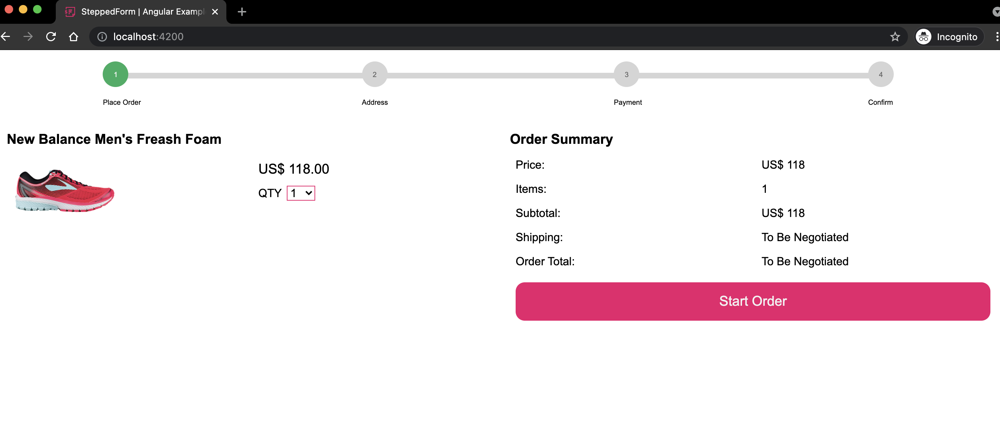
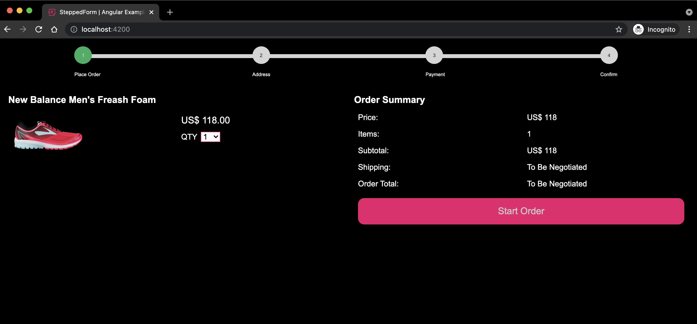

# StepeedForm Angular Example



This project was generated with [Angular CLI](https://github.com/angular/angular-cli) version 12.2.3.

This is a checkout example using [@steppedform/sf-ui](https://github.com/steppedform/sf-ui)

Please feel free to submit any issues [here](https://github.com/steppedform/sf-angular-example/issues)

## Steps to use SteppedForm in Angular:

* Add to `depdencies`:


```bash
npm i @steppedform/sf-ui --save
```

* Add `custom elements` to `schemas` your `app.module`:

```bash
import { NgModule, CUSTOM_ELEMENTS_SCHEMA } from '@angular/core';

...
schemas: [CUSTOM_ELEMENTS_SCHEMA]
...
```

No need to import `modules` in current version.


* In your `main.ts` include `custom elements`:

```bash
import { defineCustomElements } from '@steppedform/sf-ui/loader';

defineCustomElements(window);
```

* To be able to use `autocomplete` (cities, states and countries) in Angular, we need to specify the `assets` in the `angular.json`:

```bash
{
    "glob": "**/*",
    "input": "./node_modules/@steppedform/sf-ui/dist/steppedform-ui/assets",
    "output": "/assets/"
}
```

* Reactive forms or template driven forms in Angular cannot stablish a clear two way binding communication with the shadow dom. However, input changes can be detected using the `(input)` event such as:

```bash
<sf-input [sfLabel]="label" [sfId]="id" [sfRequired]="true" (input)="onInputChange('firstNameForm', $event)"></sf-input>
```

* The method to detect value changes could be as simple as:

```bash
  onInputChange(inputName, event) {
    this.contactForm[inputName] = event.target.shadowRoot.getElementById(inputName).value;
  }
```

* Depending on your theme selected, you can change your `background` color in `styles.scss`:

```bash
body {
    background-color: #000;
}
```

* To switch theme define `data-theme` in `body` (current options are `dark` and `light`):

```bash
<body data-theme="dark"> 
```



## General configuration for this example:

* `settings.ts`: Handles objects for `steps`, `payment options` and `product price` config.
* `home` component handles view and main methods.
* Inside `services` there is a folder with `utils` for `date operations` and `order processing`.

## Development server

Run `ng serve` for a dev server. Navigate to `http://localhost:4200/`. The app will automatically reload if you change any of the source files.

## Code scaffolding

Run `ng generate component component-name` to generate a new component. You can also use `ng generate directive|pipe|service|class|guard|interface|enum|module`.

## Build

Run `ng build` to build the project. The build artifacts will be stored in the `dist/` directory.

## Running unit tests

Run `ng test` to execute the unit tests via [Karma](https://karma-runner.github.io).

## Running end-to-end tests

Run `ng e2e` to execute the end-to-end tests via a platform of your choice. To use this command, you need to first add a package that implements end-to-end testing capabilities.

## Further help

To get more help on the Angular CLI use `ng help` or go check out the [Angular CLI Overview and Command Reference](https://angular.io/cli) page.
